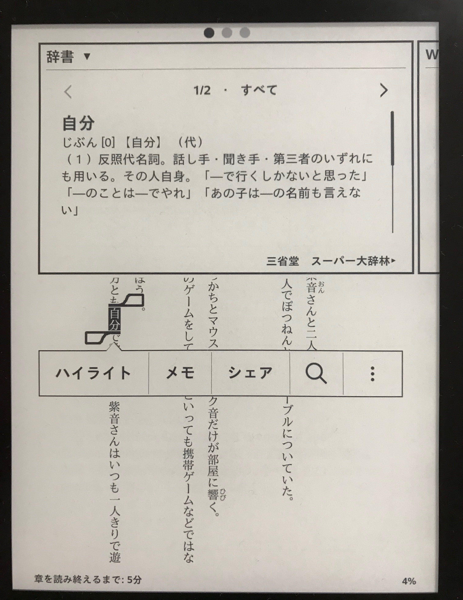
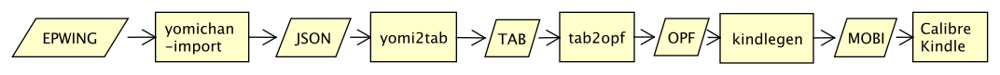
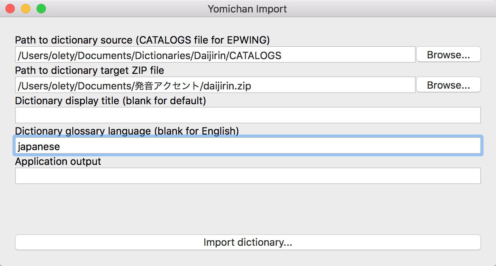

# Epwing2Kindle: A guide on how to convert Japanese EPWING dictionaries to a kindle-readable format

<p align="center">
<br/>
<sup>Demonstration of the final result</sup>
</p>

# Table of Contents

- [Process description](#process-description)
- [Usage guide](#usage-guide)
	- [1. Install the requirements](#1-install-the-requirements)
	- [2. EPWING to JSON (yomichan)](#2-epwing-to-json-yomichan)
	- [3. JSON to Tab (yomi2tab)](#3-json-to-tab-yomi2tab)
	- [4. Tab to OPF (tab2opf)](#4-tab-to-opf-tab2opf)
	- [5. OPF to mobi (kindlegen)](#5-opf-to-mobi-kindlegen)
- [Todo](#todo)
- [Another way to convert epwing](#another-way-to-convert-epwing)
- [Miscellaneous](#miscellaneous)
	- [Something isn't working!](#something-isnt-working)
	- [Kindlegen is throwing weird warnings!](#kindlegen-is-throwing-weird-warnings)
	- [I'm on Windows and having trouble installing the python requirements](#im-on-windows-and-having-trouble-installing-the-python-requirements)
	- [Why would you ever do this? Kindle offers free builtin dictionaries!](#why-would-you-ever-do-this-kindle-offers-free-builtin-dictionaries)
	- [Shoutouts](#shoutouts)


## Process description



In order to convert an EPWING dictionary to kindle, you have to follow the process displayed above: first you convert the EPWING to a stardict format (TAB-separated), then using tab2opf you can convert it to opf (html) dictionary and then generate a mobi file using kindlegen.

## Usage guide

### 1. Install the requirements

- [python 3.6 or higher](https://www.python.org/)
- [yomichan-import](https://foosoft.net/projects/yomichan-import/)
- [kindlegen](https://www.amazon.com/gp/feature.html?docId=1000765211)


You can use either pip or [conda](https://www.anaconda.com/download/) to install the python requirements:

```
pip3 install -r requirements.txt
conda install --file requirements.txt
```

### 2. EPWING to JSON (yomichan)

```
./yomichan-import
```
[Yomichan-import](https://github.com/FooSoft/yomichan-import/) is a great app that utilizes [zero-epwing](https://github.com/FooSoft/zero-epwing) to convert EPWING data into much more easily parseable JSON files.

**Note for Windows users**: Because zero-epwing does not support non-ASCII characters (like the Japanese ones), yomichan-import won't work if you have any of them in your CATALOGS path. It should work just fine on unix systems.

<br>
<p align="center">
</br>
<sup>How to use yomichan-import</sup>
</p>


### 3. JSON to Tab (yomi2tab)
```
(Unix)    python3 yomi2tab.py -o mydict.tab yomi_output/
(Windows) py -3 yomi2tab.py -o mydict.tab "C:\YOUR_PATH_HERE\yomi_output"
```

Yomichan-import generates an archive file that you have to unzip into a folder (called `yomi_output` in the above example) for `yomi2tab` to work. You can also use the `./yomi2tab.py -h` flag to see all possible usage options.

### 4. Tab to OPF (tab2opf)

```
(Unix)    python3 tab2opf.py mydict.tab
(Windows) py -3 tab2opf.py mydict.tab
```

Running this command will create a folder called `opf/` that will contain the opf/html dictionary you can use in the next step.

This repository provides a japanese-specific tab2opf tool with some improvements (adding progress indicators, correct display of `<`/`>`, etc.). It is based on https://github.com/apeyser/tab2opf by Alexander Peyser from 2015 which itself is based on the generally available tab2opf.py by Klokan Petr Přidal (www.klokan.cz) from 2007.

### 5. OPF to mobi (kindlegen)

```
kindlegen opf/mydict.opf
```

In order to generate a .mobi dictionary from OPF, you can use a tool called [kindlegen](https://www.amazon.com/gp/feature.html?docId=1000765211) that's provided by amazon. It may take a while to convert everything but doesn't require any extra work.

After you've generated a .mobi dictionary, you can import it into [calibre](https://calibre-ebook.com) to edit the metadata, add a cover picture and send it to kindle.

## Todo

*PR's are welcome!*

- [x] Convert EPWING dictionary to kindle
- [x] Proper formatting, newlines are rendering as they should be
- [x] \(mostly) Optional "Simple" mode without old ways to write a word that use outdated kana
- [x] Support kanji when the entry is formatted as `[Kanji/Hiragana]Katakana[K/H]`
- [x] Multiple entries for the same word (not merging all of the definitions into one; official kindle dictionaries function in this way)
- [x] Tested with 大辞林
- [ ] Add a zsh/python script for processing everything automatically
- [ ] Better sorting for multiple entries
- [ ] Test more dictionaries
- [ ] Improve performance (low priority)
- [ ] Make it possible to look up suffixes (stuff like -好き; low priority)
- [ ] Make it possible to look up phrases with `=` in their key (It's probably another weird EPWING thing; low priority)

*Note*: this process was tested using スーパー大辞林, using it with other dictionaries like 新明解国語辞典 should still work but some unexpected problems may arise. If you manage to successfully import another dictionary using this repo, please add a photo of your final result to the images folder via a pull request.


## Another way to convert epwing

We can also use the noj format as an intermediary between the EPWING dictionary and the tab file.

**Steps:**

1. https://github.com/mcho421/noj_dumpers
	*  Don't bother with compiling it because won't work, just copy your files to the noj_dumper folder and then `python2 noj_dumper.py epwing_folder`
2. https://github.com/asika/noj2tab (you can try reading the Chinese blog post with google translate)
3. Tab2Opf (mine or https://github.com/apeyser/tab2opf)
4. kindlegen + calibre


## Miscellaneous

### Something isn't working!

Open an [issue](https://github.com/olety/epwing2kindle/issues) on github, I'm checking this page quite regularly and will respond as soon as I can.

Also, please check closed issues before opening a new one, maybe your problem was already solved there.

### Kindlegen is throwing weird warnings!

If it actually produces a .mobi file at the end those warnings can be ignored; try putting the resulting dictionary on your kindle first and check if you can look up words. If not, open an [issue](https://github.com/olety/epwing2kindle/issues) :)

### I'm on Windows and having trouble installing the python requirements

Check issue [#1](https://github.com/olety/epwing2kindle/issues/1) - you may have to install [Build Tools for Visual Studio](https://visualstudio.microsoft.com/downloads/#build-tools-for-visual-studio-2017) to get everything working.

### Why would you ever do this? Kindle offers free builtin dictionaries!

デジタル大辞泉 provided with Kindle doesn't have pitch accent marks.

### Shoutouts

- [Cophnia61](https://forum.koohii.com/user-4654.html) - https://forum.koohii.com/thread-14949.html (I'm not Xavier22 😁 )
- [gh-md-toc](https://github.com/ekalinin/github-markdown-toc) - *the* TOC generator for github
- [Xavier22](https://github.com/erikolson97), for helping with the Windows-specific instructions

And you, if you actually convert your epwing to mobi! 😊
